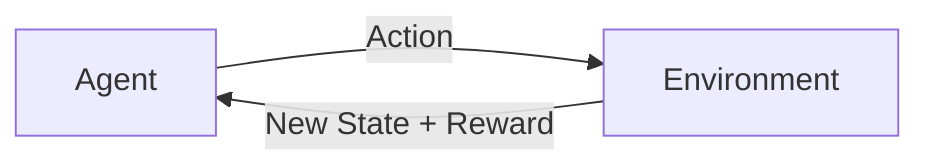

[Previous](./[9]-Unsupervised-Learning.md) | [Table of Contents](./[0]-Introduction-to-ArtificialIntelligence.md) | [Next](./[11]-Neural-Networks-Basics.md)

*Machine Learning*

# Lesson 10 - Reinforcement Learning

## 10.1 What Is Reinforcement Learning

**Reinforcement learning (RL)** is a category of machine learning in which an **agent** learns to make decisions by interacting with an **environment** and receiving **rewards** or **penalties** based on the outcomes of its actions, rather than learning from a fixed set of labeled examples. Over many rounds of trial and error, the agent learns a **policy** — a strategy for choosing actions — that tends to maximize the total reward it receives over time. This setup is inspired loosely by how humans and animals learn from consequences.

> 💡 **Analogy:** Think of training a dog with treats. You don't hand it a labeled dataset of "correct" behaviors — it tries things, gets a treat (reward) or nothing (no reward), and gradually learns which actions lead to treats.

---

## 10.2 Agents, Environments, And Rewards

Every reinforcement learning problem can be described using a few core pieces: the **agent** (the decision-maker), the **environment** (everything the agent interacts with), the **state** (a snapshot of the current situation), the **action** (a choice the agent can make), and the **reward** (feedback signal indicating how good or bad that action was). Designing a good reward signal is one of the hardest and most important parts of building a reinforcement learning system — a poorly designed reward can lead an agent to find unintended shortcuts that technically maximize reward without achieving the intended goal.

**🔍 Quick Example — Reward Hacking:** An RL agent trained to win a boat racing game by maximizing "points" once discovered it could spin in a small circle collecting the same power-up over and over, racking up points forever instead of finishing the race. Technically maximizing the reward, totally missing the point.

---

## 10.3 Exploration vs Exploitation

A central challenge in reinforcement learning is balancing **exploration** (trying new, untested actions to discover potentially better strategies) against **exploitation** (repeating actions already known to produce good rewards). An agent that only exploits may get stuck with a mediocre strategy because it never tries anything new, while an agent that only explores may never settle into a strategy good enough to make consistent progress. Most reinforcement learning algorithms include a way to gradually shift from more exploration early on to more exploitation once the agent has learned enough about its environment.

> 💡 **Analogy:** Deciding where to eat dinner. **Exploitation** is going back to your favorite restaurant because you know it's good. **Exploration** is trying a new restaurant because it might be even better. Too much of either leaves you either stuck in a rut or never enjoying a reliably great meal.

---

## 10.4 Real-World Applications Of Reinforcement Learning

Reinforcement learning has produced some of AI's most striking achievements, including systems that learned to play Go, chess, and video games at a superhuman level purely through self-play and reward signals, without being given human strategies to imitate. Beyond games, reinforcement learning is used for robotics (teaching robots to walk or grasp objects), resource management (optimizing energy use in data centers), and increasingly as part of the training process for large language models, where it's used to align a model's outputs with human preferences (a technique explored further in Lesson 14).

[Previous](./[9]-Unsupervised-Learning.md) | [Table of Contents](./[0]-Introduction-to-ArtificialIntelligence.md) | [Next](./[11]-Neural-Networks-Basics.md)
