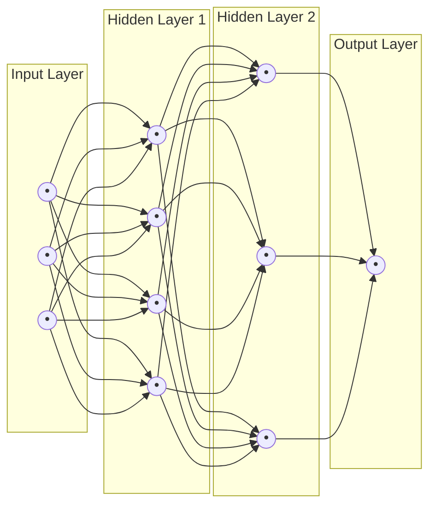

[Previous](./[10]-Reinforcement-Learning.md) | [Table of Contents](./[0]-Introduction-to-ArtificialIntelligence.md) | [Next](./[12]-Deep-Learning-Architectures.md)

*Neural Networks And Deep Learning*

# Lesson 11 - Neural Networks Basics

## 11.1 Biological Inspiration

Artificial neural networks are loosely inspired by the structure of biological brains, where billions of interconnected neurons pass electrical signals to one another. This inspiration is more conceptual than literal — artificial neural networks are highly simplified mathematical models, not simulations of real brain tissue — but the basic idea carries over: many simple, interconnected units, each doing a small amount of processing, can together produce complex behavior that no single unit could produce alone.

> 💡 **Analogy:** No single ant "understands" how to build a colony, but thousands of ants following simple local rules produce a complex structure. Similarly, no single artificial neuron "understands" a cat photo — but thousands of them working together can recognize one.

---

## 11.2 The Artificial Neuron

An **artificial neuron** takes in one or more numeric inputs, multiplies each by a learned **weight**, sums them together along with a **bias** term, and passes the result through an **activation function** to produce an output. The activation function introduces non-linearity — without it, stacking multiple layers of neurons would mathematically collapse into something no more powerful than a single layer. Common activation functions include **ReLU** (which outputs zero for negative inputs and passes positive inputs through unchanged) and **sigmoid** (which squashes any input into a value between 0 and 1, often used to represent probabilities).

```
inputs      weights
  x1 ------ w1 \
  x2 ------ w2  >--sum + bias--> activation function --> output
  x3 ------ w3 /
```

**🔍 Quick Example:** If x1=2, w1=0.5, x2=1, w2=-1, and bias=0.3: sum = (2×0.5) + (1×-1) + 0.3 = 0.3. Pass 0.3 through ReLU → stays 0.3 (since it's positive). That's one neuron's full computation.

---

## 11.3 Layers And Architecture

Neurons are organized into **layers**: an **input layer** that receives the raw features, one or more **hidden layers** that progressively transform the data, and an **output layer** that produces the final prediction. A network with more than one hidden layer is generally called a **deep neural network**, which is where the term "deep learning" comes from. The specific arrangement of layers, how they connect, and what type each layer is — collectively called the network's **architecture** — has a major effect on what kinds of patterns the network can learn efficiently, as explored further with specialized architectures in Lesson 12.



---

## 11.4 Training With Backpropagation

Training a neural network means finding the weights and biases that make its predictions as accurate as possible on the training data. This is done using **backpropagation**, an algorithm that calculates how much each individual weight contributed to the network's overall error, and **gradient descent**, an optimization method that nudges each weight slightly in the direction that reduces that error. This process is repeated over many passes through the training data (called **epochs**) until the network's performance stops improving meaningfully, at which point training is typically stopped to avoid overfitting (see Lesson 7.4).

> 💡 **Analogy:** Backpropagation is like adjusting a recipe after a bad-tasting dish: you trace back which ingredient (weight) probably caused the problem, then nudge that ingredient's amount slightly for next time — repeating across many attempts until the dish tastes right.

[Previous](./[10]-Reinforcement-Learning.md) | [Table of Contents](./[0]-Introduction-to-ArtificialIntelligence.md) | [Next](./[12]-Deep-Learning-Architectures.md)
