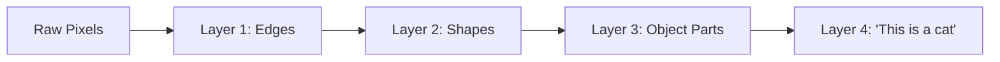
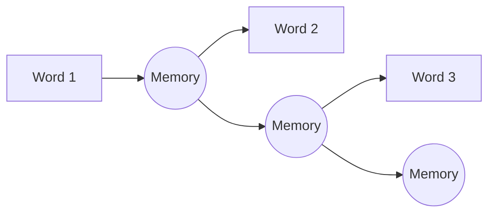

[Previous](./[11]-Neural-Networks-Basics.md) | [Table of Contents](./[0]-Introduction-to-ArtificialIntelligence.md) | [Next](./[13]-Natural-Language-Processing.md)

*Neural Networks And Deep Learning*

# Lesson 12 - Deep Learning Architectures

## 12.1 What Makes Learning "Deep"

"Deep" learning refers to neural networks with many hidden layers stacked on top of each other, allowing the network to learn increasingly abstract representations of the input as data passes through successive layers. In an image-recognition network, for example, early layers might learn to detect simple edges and textures, middle layers might combine these into shapes, and later layers might combine shapes into recognizable objects. This layered, hierarchical feature learning is what allows deep networks to handle raw, complex data (like pixels or audio waveforms) without needing hand-engineered features.

> 💡 **Analogy:** It's like recognizing a face from far away: first you notice blobs of light and dark (edges), then features like eyes and a nose (shapes), then finally you recognize "that's my friend Sam" (the object). Each layer builds on the last.

---

## 12.2 Convolutional Neural Networks

**Convolutional Neural Networks (CNNs)** are a specialized architecture designed for grid-like data such as images. Instead of connecting every input to every neuron (which would be extremely inefficient for large images), CNNs use small, learnable filters that slide across the image, each detecting a specific local pattern (like an edge or a curve) regardless of where in the image it appears. This design, combined with pooling layers that reduce the size of the data as it moves through the network, makes CNNs both computationally efficient and very effective at image-related tasks like classification and object detection (see Lesson 15).

**🔍 Quick Example:** Imagine a tiny 3x3 "stamp" that detects vertical edges, sliding across an entire photo left to right, top to bottom, stamping down a score everywhere it finds a vertical edge. That's a convolutional filter — and a network learns to design its own useful stamps automatically.

---

## 12.3 Recurrent Neural Networks

**Recurrent Neural Networks (RNNs)** are designed for sequential data, such as text or time series, where the order of the data matters and earlier elements can influence how later ones should be interpreted. Unlike a standard neural network, an RNN maintains a form of internal "memory" that's updated as it processes each element in the sequence, letting it carry information forward from earlier steps. Variants like **LSTMs (Long Short-Term Memory networks)** were developed to address RNNs' difficulty in retaining information over very long sequences, and were the dominant approach for sequence tasks before transformers became popular.

*Each step carries forward a "memory" of everything seen so far — like reading a sentence word by word and remembering the beginning.*

---

## 12.4 Transformers

**Transformers** are the architecture behind most modern large language models and many other state-of-the-art AI systems. Instead of processing a sequence one element at a time like an RNN, transformers use a mechanism called **attention**, which lets the model directly weigh the relevance of every other element in the sequence when processing each element — allowing it to capture long-range relationships (like a pronoun referring back to a noun many sentences earlier) more effectively, and to process sequences in parallel rather than step by step, making training dramatically faster on modern hardware. Transformers were introduced in 2017 and rapidly became the foundation for the generative AI systems discussed in Lesson 14.

> 💡 **Analogy:** Reading a mystery novel with an RNN is like reading it one word at a time and trying to remember every clue in order. Reading it with a transformer's attention mechanism is like being able to instantly flip back to any earlier page the moment it becomes relevant — "wait, that clue on page 12 matters now."

| Architecture | Best For | Processes Sequentially? |
|---|---|---|
| CNN | Images, grids | No |
| RNN / LSTM | Sequences, older approach | Yes (slow) |
| Transformer | Sequences, modern LLMs | No (parallel) |

[Previous](./[11]-Neural-Networks-Basics.md) | [Table of Contents](./[0]-Introduction-to-ArtificialIntelligence.md) | [Next](./[13]-Natural-Language-Processing.md)
