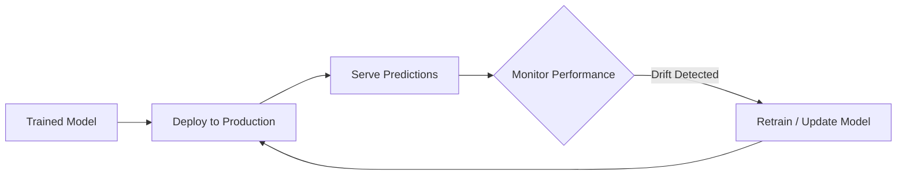

[Previous](./[15]-Computer-Vision.md) | [Table of Contents](./[0]-Introduction-to-ArtificialIntelligence.md) | [Next](./[17]-Ethics-And-Bias-In-AI.md)

*Modern AI And Applications*

# Lesson 16 - AI In The Real World

## 16.1 AI In Everyday Products

AI has quietly become embedded in many everyday products: streaming services use recommendation systems to suggest what to watch next, email clients use classification models to filter spam, cameras use computer vision to auto-focus on faces, and virtual assistants use natural language processing to respond to voice commands. Most users interact with several AI systems a day without necessarily thinking of them as "AI," since the technology tends to fade into the background of a well-designed product.

**🔍 Quick Example — Your Morning, Powered by AI:**
1. ☕ Phone alarm — smart alarm suggests wake time based on your sleep pattern
2. 📧 Check email — spam filter (classification) already cleaned your inbox overnight
3. 🎵 Commute playlist — recommendation system picked songs for you
4. 📸 Snap a photo — computer vision auto-focused and enhanced it

---

## 16.2 AI In Industry

Beyond consumer products, AI has become a significant tool across many industries. In healthcare, AI assists with diagnostic imaging and drug discovery. In finance, it's used for fraud detection and algorithmic trading. In manufacturing, computer vision inspects products for defects and predictive models schedule maintenance before equipment fails. In agriculture, AI-powered image analysis helps monitor crop health from drone or satellite imagery. Across these examples, AI's role is typically to make some existing process faster, cheaper, or more precise, rather than to replace human oversight entirely.

| Industry | AI Use Case |
|---|---|
| Healthcare | Diagnostic imaging, drug discovery |
| Finance | Fraud detection, algorithmic trading |
| Manufacturing | Defect inspection, predictive maintenance |
| Agriculture | Crop health monitoring via drone imagery |

---

## 16.3 Deploying AI Models

Building a working machine learning model is only part of putting AI to use — the model also needs to be **deployed**, meaning integrated into a real system where it can receive new input and return predictions reliably, quickly, and at scale. This involves considerations that go beyond the model itself: how to serve predictions with low latency, how to monitor performance over time (since a model's accuracy can degrade as real-world data shifts away from its training data, a problem known as "model drift"), and how to safely roll out updates to a model without disrupting the systems that depend on it.

> 💡 **Analogy:** Model drift is like a GPS app trained on old road maps — it still "works," but as new roads get built and old ones close, its recommendations quietly get worse until someone notices and retrains it on fresh data.

---

## 16.4 Working With AI APIs And Tools

Rather than training models from scratch, many developers and businesses build AI-powered features by using existing, pre-trained models through an **API (Application Programming Interface)** — sending a request (such as text to summarize or an image to classify) to a cloud-hosted model and receiving a result back. This approach dramatically lowers the barrier to building AI-powered applications, since it removes the need for specialized machine learning expertise, large datasets, or expensive computing infrastructure. Popular categories of AI tools include APIs for language models, image generation, speech-to-text, and computer vision, many of which offer free tiers for experimentation.

[Previous](./[15]-Computer-Vision.md) | [Table of Contents](./[0]-Introduction-to-ArtificialIntelligence.md) | [Next](./[17]-Ethics-And-Bias-In-AI.md)
