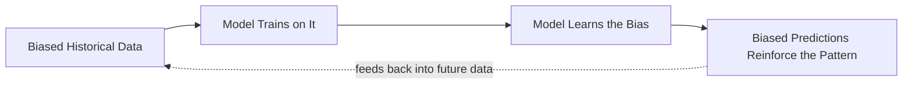

[Previous](./[16]-AI-In-The-Real-World.md) | [Table of Contents](./[0]-Introduction-to-ArtificialIntelligence.md) | [Next](./[18]-The-Future-Of-AI.md)

*Ethics And Future*

# Lesson 17 - Ethics And Bias In AI

## 17.1 Bias In Data And Models

AI models learn from data created by people, which means they can absorb and reproduce the biases present in that data — an AI hiring tool trained on historical hiring decisions might learn to favor characteristics correlated with a majority group simply because that reflects past decisions, not because those characteristics predict job performance. Bias can enter at multiple stages: in the data collected, in the labels assigned to that data, in the choice of features, or in how a model's output is used, which is why addressing bias requires attention throughout the entire AI development process rather than at a single step.

> 💡 **Analogy:** A biased dataset is like a mirror that's slightly warped — it doesn't invent a distortion, it faithfully reflects one that was already there in the world, then hands that same distortion to anyone who looks into it.

---

## 17.2 Fairness And Accountability

**Fairness** in AI is genuinely difficult to define precisely, because there are multiple, sometimes mutually incompatible, mathematical definitions of what a "fair" outcome looks like across different groups. Beyond fairness as a technical property, **accountability** asks a broader question: when an AI system causes harm — denying someone a loan unfairly, or misidentifying someone in a security context — who is responsible, and how can that harm be identified, explained, and corrected? Building accountable AI systems generally requires transparency about how a system makes decisions and clear processes for people to challenge or appeal those decisions.

**🔍 Quick Example:** Should a loan-approval model aim for equal approval *rates* across groups, or equal *accuracy* across groups? These sound similar but can conflict mathematically — satisfying one can make the other worse. There's no single "correct" answer; it depends on values and context.

---

## 17.3 Privacy And Surveillance

AI systems, particularly those involving personal data or computer vision, raise significant privacy concerns. Facial recognition technology can enable large-scale surveillance, tracking individuals' movements and behavior often without their knowledge or consent. Large language models trained on vast amounts of internet text also raise questions about whether personal information within their training data can be inadvertently reproduced or inferred. These concerns have led to increased regulation in some regions, alongside a growing set of technical practices aimed at protecting privacy (such as removing personal information from training data before it's used).

---

## 17.4 Responsible AI Development

**Responsible AI development** refers to a set of practices aimed at building AI systems that are safe, fair, transparent, and beneficial. Common practices include: testing models across diverse groups to catch disparities in performance before deployment, documenting a model's intended use cases and known limitations, keeping meaningful human oversight in high-stakes decisions rather than fully automating them, and establishing clear channels for feedback and correction after a system is deployed. No single practice guarantees a fully "safe" AI system, which is why responsible development is best understood as an ongoing process rather than a one-time checklist.

[Previous](./[16]-AI-In-The-Real-World.md) | [Table of Contents](./[0]-Introduction-to-ArtificialIntelligence.md) | [Next](./[18]-The-Future-Of-AI.md)
