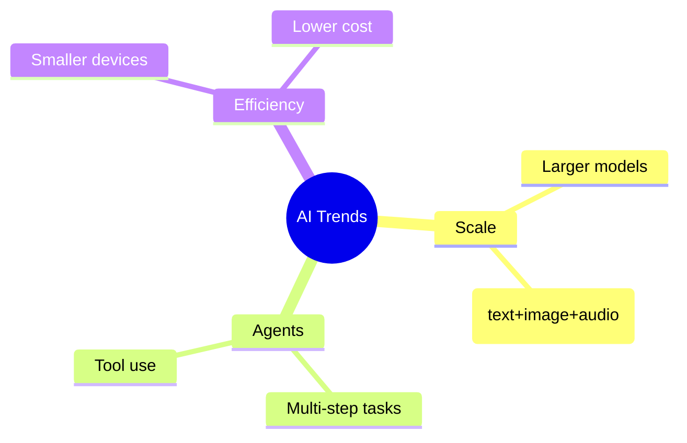

[Previous](./[17]-Ethics-And-Bias-In-AI.md) | [Table of Contents](./[0]-Introduction-to-ArtificialIntelligence.md)

*Ethics And Future*

# Lesson 18 - The Future Of AI

## 18.1 Current Trends

Several trends currently shape the direction of AI research and deployment: models continue to grow in scale and capability, particularly large language and multimodal models that can handle text, images, and audio together; AI is being integrated as an "agent" that can take multi-step actions and use external tools rather than just answering single questions; and there is growing focus on making powerful models more efficient, so they can run on smaller devices rather than only in large data centers. These trends aren't guaranteed to continue indefinitely, but they represent where much current research and investment is concentrated.

---

## 18.2 Open Research Questions

Despite rapid progress, several fundamental questions in AI remain unresolved. Researchers are still working out how to give AI systems reliable common-sense reasoning and robust understanding of cause and effect, rather than pattern matching alone. There's ongoing debate about how to reduce hallucination (see Lesson 14.4) and make models' outputs verifiably trustworthy. And there's active disagreement about how close current techniques actually bring us to more general forms of intelligence (see Lesson 1.2), versus how much further breakthroughs would be required.

**🔍 Quick Example:** A model can write a flawless essay on Newton's laws yet fail to predict what happens if you push a cup slightly off a table — a small but telling gap between fluent language and genuine physical common sense.

---

## 18.3 AI Safety And Alignment

**AI safety** is the study of how to prevent AI systems from causing unintended harm, ranging from near-term concerns (a recommendation algorithm inadvertently promoting harmful content) to longer-term concerns about more capable future systems. **Alignment** specifically refers to the challenge of ensuring an AI system's goals and behavior actually match what its developers and users intend, which turns out to be surprisingly difficult — a system optimized for a stated objective can find unexpected ways to satisfy that objective's literal wording while missing its actual intent. As AI systems become more capable and are given more autonomy, safety and alignment research has become an increasingly central and well-funded part of the field.

> 💡 **Analogy:** Alignment is like the classic genie-in-a-lamp problem: you wish for something specific, and the genie grants exactly what you said — not what you meant — with unintended consequences. Alignment research tries to close that gap between "what we said" and "what we actually wanted."

---

## 18.4 Where To Go Next

This Topic has covered the foundational concepts of artificial intelligence, from search and knowledge representation through machine learning, neural networks, and modern generative AI, closing with the ethical and safety considerations that come with deploying these systems responsibly. From here, natural next steps include diving deeper into a specific subfield that interests you (such as computer vision, NLP, or reinforcement learning), working hands-on with real datasets and frameworks to build and train your own models, and following current AI research and news to keep pace with a field that continues to move quickly. The concepts introduced here should provide a solid foundation for understanding new developments as they emerge, whatever specific direction you choose to pursue.

**🎓 Course Recap**

| Section | Lessons | Big Idea |
|---|---|---|
| Foundations | 1–3 | What AI is, its history, and its types |
| Core Concepts | 4–6 | Data, search, and knowledge representation |
| Machine Learning | 7–10 | Supervised, unsupervised, and reinforcement learning |
| Neural Networks & Deep Learning | 11–13 | Neurons, architectures, and language |
| Modern AI & Applications | 14–16 | Generative AI, vision, and real-world deployment |
| Ethics And Future | 17–18 | Bias, fairness, safety, and what's next |

[Previous](./[17]-Ethics-And-Bias-In-AI.md) | [Table of Contents](./[0]-Introduction-to-ArtificialIntelligence.md)
