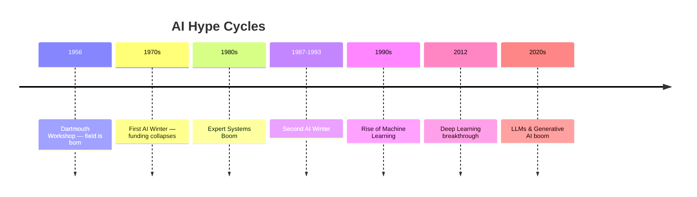

[Previous](./[1]-What-Is-Artificial-Intelligence.md) | [Table of Contents](./[0]-Introduction-to-ArtificialIntelligence.md) | [Next](./[3]-Types-Of-AI-Systems.md)

*Foundations*

# Lesson 2 - History Of Artificial Intelligence

## 2.1 Early Ideas And The Birth Of AI

The theoretical roots of AI go back to the 1940s and 50s, when researchers such as Alan Turing began asking whether machines could "think," and proposed the Turing Test as a practical way to evaluate machine intelligence through conversation. The field was formally named at the 1956 Dartmouth Workshop, where researchers gathered with the ambitious goal of building machines that could simulate every aspect of human intelligence.

Early AI research focused on symbolic approaches: programs that manipulated logical symbols and rules to solve problems like theorem proving and simple games. These early systems achieved surprising early successes on narrow, well-defined problems, which fueled optimism that general machine intelligence was close at hand.

> 💡 **Analogy:** The Turing Test is like a blind taste test, but for conversation. If a judge chats with both a human and a machine through text and can't reliably tell which is which, the machine "passes." It says nothing about whether the machine actually *understands* — only whether it can convincingly imitate.

---

## 2.2 The AI Winters

By the 1970s, the gap between early ambitions and what symbolic AI could actually deliver became apparent — systems struggled with tasks that required common sense or dealing with ambiguous, real-world data. Funding and interest dropped sharply, a period now called the first "AI winter." A second wave of enthusiasm in the 1980s around expert systems (see Lesson 6) also eventually cooled when these systems proved expensive to build and brittle to maintain, leading to a second AI winter in the late 1980s and early 1990s.

These winters are an important part of AI's story: they show that progress in the field has historically been uneven, driven by cycles of hype followed by more sober reassessment, a pattern worth remembering when evaluating any new wave of AI advances.

**🔍 Quick Example:** Imagine investing heavily in a "translating machine" in the 1960s, promising fluent translation within years — then watching it produce nonsensical output on any sentence with ambiguity. That gap between promise and delivery is exactly what triggered funding cuts.

---

## 2.3 The Rise Of Machine Learning

Starting in the 1990s, AI research shifted away from hand-coded rules and toward machine learning: systems that improve their performance by learning statistical patterns from data rather than being explicitly programmed with logic. Growth in available data, cheaper computing power, and better algorithms (such as support vector machines and improved decision trees) drove steady progress on practical tasks like spam filtering, fraud detection, and recommendation systems.

This shift in approach — from telling the machine the rules to letting the machine find the rules in data — is arguably the most important turning point in AI's history, and it set the stage for the deep learning era that followed.

> 💡 **Analogy:** It's the difference between teaching a kid to recognize dogs by reciting a checklist ("four legs, fur, a tail, barks") versus just showing them a thousand photos labeled "dog" or "not dog" and letting them figure out the pattern themselves. The second approach turned out to generalize far better.

---

## 2.4 The Deep Learning Revolution

In the early 2010s, a class of machine learning models called deep neural networks (see Lessons 11–12) began dramatically outperforming previous methods on tasks like image recognition and speech recognition, thanks to larger datasets, more powerful GPUs, and refined training techniques. A milestone moment was 2012, when a deep convolutional neural network substantially beat all competitors in a major image recognition competition, convincing much of the research community to invest heavily in deep learning.

This revolution continued through the 2010s and into the 2020s with breakthroughs in natural language processing, culminating in large language models and generative AI systems capable of producing humanlike text, images, and code — the technologies explored later in this Topic.

[Previous](./[1]-What-Is-Artificial-Intelligence.md) | [Table of Contents](./[0]-Introduction-to-ArtificialIntelligence.md) | [Next](./[3]-Types-Of-AI-Systems.md)
