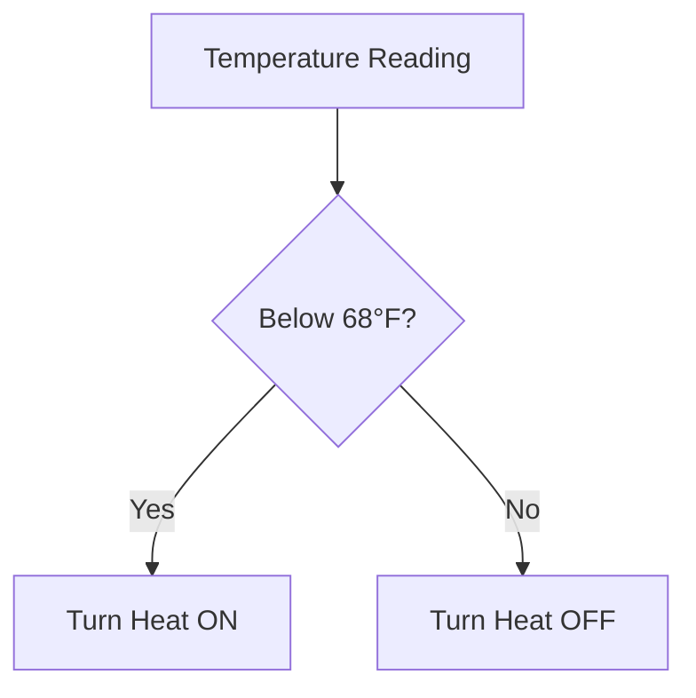
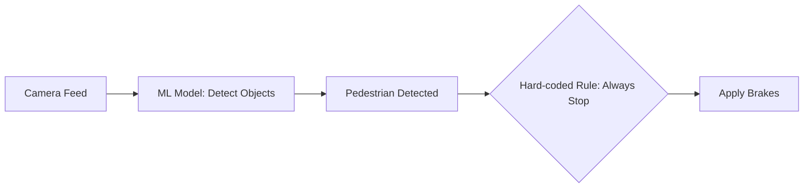

[Previous](./[2]-History-Of-Artificial-Intelligence.md) | [Table of Contents](./[0]-Introduction-to-ArtificialIntelligence.md) | [Next](./[4]-Data-And-Features.md)

*Foundations*

# Lesson 3 - Types Of AI Systems

## 3.1 Rule-Based Systems

Rule-based (symbolic) AI systems make decisions using explicitly written rules, usually in the form of "if this condition, then this action." A thermostat that turns on heating below a set temperature, or a customer-support chatbot that follows a fixed decision tree, are simple examples. Rule-based systems are transparent and predictable — you can trace exactly why a decision was made — but they don't scale well to problems with too many edge cases, and they can't improve automatically from experience.

> 💡 **Analogy:** A rule-based system is like a recipe card — follow the steps exactly and you get a predictable result every time. But if a real kitchen emergency isn't on the card (you're out of an ingredient, the oven breaks), the recipe has nothing to say.

---

## 3.2 Machine Learning Systems

Machine learning systems, in contrast, learn their decision logic from data rather than having it hand-written. Instead of a programmer specifying every rule for detecting spam email, a machine learning system is shown thousands of examples of spam and non-spam and learns the statistical patterns that distinguish them. This makes machine learning systems far more flexible and capable on complex, real-world problems, but also harder to fully explain, since the "rules" they learn are encoded in numerical parameters rather than readable logic.

**🔍 Quick Example:** Try writing an explicit rule for "this email is spam." You might say "contains the word FREE in all caps" — but spammers adapt instantly. A machine learning model instead learns dozens of subtle, shifting signals at once, which is much harder to dodge.

---

## 3.3 Hybrid Systems

Many practical AI systems combine rule-based and machine-learning components — a hybrid approach that plays to the strengths of each. For example, a self-driving car might use a machine learning model to perceive and classify objects on the road but rely on explicit, hand-coded safety rules to decide how to react to those classifications (e.g., "always stop for a detected pedestrian"). Hybrid systems are common wherever some part of the problem is well understood and needs guaranteed behavior, and another part is too complex to fully specify by hand.

> 💡 **Analogy:** Think of a hybrid system like a pilot with autopilot. The autopilot (machine learning) handles routine flying because it's flexible and adaptive, but hard safety rules (rule-based) always override it — "never descend below X altitude near terrain" — no matter what the autopilot suggests.

---

## 3.4 Classifying AI By Capability

AI systems can also be grouped by their level of capability rather than their technique:

- **Reactive machines** respond to current input with no memory of the past (e.g., a basic game-playing program that only evaluates the current board state).
- **Limited memory systems** use recent past data to inform decisions, which describes most modern machine learning systems, including self-driving cars that track recently observed vehicles.
- **Theory of mind** and **self-aware** systems are largely theoretical categories, referring to AI that could understand others' mental states or have its own form of awareness — neither currently exists.

This capability-based view is a useful complement to the technique-based view (rule-based vs. machine learning vs. hybrid), since it highlights how far current systems still are from human-like general intelligence.

| Capability Level | Has Memory? | Example | Exists Today? |
|---|---|---|---|
| Reactive | No | Basic tic-tac-toe bot | ✅ |
| Limited Memory | Yes, recent | Self-driving car | ✅ |
| Theory of Mind | Understands others' beliefs | — | ❌ Theoretical |
| Self-Aware | Has own consciousness | — | ❌ Theoretical |

[Previous](./[2]-History-Of-Artificial-Intelligence.md) | [Table of Contents](./[0]-Introduction-to-ArtificialIntelligence.md) | [Next](./[4]-Data-And-Features.md)
