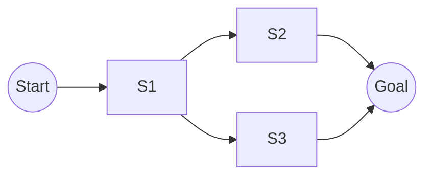

[Previous](./[4]-Data-And-Features.md) | [Table of Contents](./[0]-Introduction-to-ArtificialIntelligence.md) | [Next](./[6]-Knowledge-Representation-And-Reasoning.md)

*Core Concepts*

# Lesson 5 - Search And Problem Solving

## 5.1 AI As A Search Problem

Many classic AI problems can be framed as a **search** through a space of possible states, looking for a path from a starting state to a goal state. Solving a maze, planning a route on a map, or finding the sequence of moves that wins a puzzle can all be modeled this way: each configuration is a "state," and each allowed move creates an "edge" to a new state. Framing a problem as search makes it possible to apply general-purpose algorithms rather than solving each problem from scratch.

> 💡 **Analogy:** Think of your phone's maps app. Every intersection is a "state," every road is a move between states, and the app searches through this maze of possibilities to find you a path to your destination.

---

## 5.2 Uninformed Search

**Uninformed** (or "blind") search algorithms explore the state space without any additional information about which direction is likely to lead to the goal. **Breadth-first search** explores all states at the current depth before going deeper, guaranteeing the shortest path in simple cases but potentially exploring a huge number of states. **Depth-first search** dives as deep as possible along one path before backtracking, which uses less memory but doesn't guarantee the shortest solution. These algorithms are simple and general, but can be inefficient on large problems since they don't use any knowledge about the specific problem to guide their search.

**🔍 Quick Example:** Imagine searching a building for a friend by checking every room on the ground floor before going upstairs (breadth-first), versus picking one staircase and running all the way to the top before backtracking (depth-first). Neither uses any clue about where your friend actually is.

---

## 5.3 Informed (Heuristic) Search

**Informed search** algorithms use a **heuristic** — an estimate of how close a given state is to the goal — to guide the search more efficiently toward promising paths. The **A\* (A-star) algorithm**, one of the most widely used search algorithms in AI, combines the cost already spent reaching a state with a heuristic estimate of the remaining cost, letting it find optimal solutions much faster than uninformed search in practice. Heuristic search is behind many real-world systems, from GPS route planning to puzzle solvers.

> 💡 **Analogy:** Now imagine you're searching that same building for your friend, but you can smell their coffee from the east wing. That "smell" is a heuristic — an imperfect but useful hint that lets you skip searching the west wing entirely.

| Search Type | Uses Heuristic? | Guarantees Shortest Path? | Example Use |
|---|---|---|---|
| Breadth-First | No | Yes (unweighted) | Simple maze solving |
| Depth-First | No | No | Puzzle exploration |
| A* | Yes | Yes (with good heuristic) | GPS navigation |

---

## 5.4 Adversarial Search And Games

**Adversarial search** applies these same ideas to situations with an opponent actively trying to prevent you from reaching your goal, such as in board games like chess or tic-tac-toe. The **minimax algorithm** handles this by assuming the opponent will always make the move that's worst for you, and choosing your own move to make the best of that worst case; **alpha-beta pruning** is a common optimization that skips branches of the search that can't possibly affect the final decision. These techniques powered early game-playing AI, such as IBM's Deep Blue defeating chess champion Garry Kasparov in 1997, long before modern machine learning approaches became dominant in game-playing AI.

[Previous](./[4]-Data-And-Features.md) | [Table of Contents](./[0]-Introduction-to-ArtificialIntelligence.md) | [Next](./[6]-Knowledge-Representation-And-Reasoning.md)
