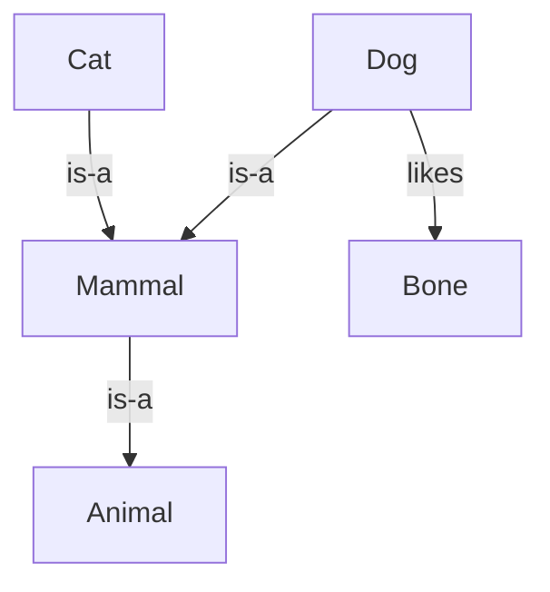

[Previous](./[5]-Search-And-Problem-Solving.md) | [Table of Contents](./[0]-Introduction-to-ArtificialIntelligence.md) | [Next](./[7]-Introduction-To-Machine-Learning.md)

*Core Concepts*

# Lesson 6 - Knowledge Representation And Reasoning

## 6.1 Representing Knowledge

Before a machine can reason about the world, it needs some way to represent facts about the world internally. **Knowledge representation** is the study of how to encode information — objects, their properties, and the relationships between them — in a form a computer can store and manipulate. Choices range from simple lists of facts to rich structures capturing hierarchies and rules, and the right choice depends heavily on what kind of reasoning the system needs to do with that knowledge.

> 💡 **Analogy:** It's like the difference between a sticky-note pile of random facts and a well-organized filing cabinet with labeled folders and cross-references. Both "contain" the same information, but only one lets you reason about it efficiently.

---

## 6.2 Logic-Based Reasoning

One of the oldest approaches to reasoning in AI uses formal **logic**, where facts are stated as logical propositions and new facts are derived using rules of inference. **Propositional logic** deals with whole statements that are true or false (e.g., "it is raining"), while **first-order logic** extends this with objects, properties, and quantifiers (e.g., "all birds can fly," "some bird named Tweety exists"). Logic-based reasoning is precise and verifiable, which makes it attractive for domains like formal verification, but it struggles with the uncertainty and exceptions common in real-world knowledge (not all birds can actually fly).

**🔍 Quick Example**
```
Rule:      All birds can fly.
Fact:      Tweety is a bird.
Inference: Tweety can fly.        ✅ works... until Tweety is a penguin!
```
This "penguin problem" is exactly why pure logic struggles with messy real-world exceptions.

---

## 6.3 Semantic Networks And Ontologies

A **semantic network** represents knowledge as a graph of concepts connected by labeled relationships — for instance, "dog" connected to "mammal" by an "is-a" link, and to "bone" by a "likes" link. An **ontology** formalizes this further, defining a shared, structured vocabulary of concepts and relationships for a specific domain, so that different systems can consistently interpret the same knowledge. These structures underpin technologies like search engine knowledge panels and some recommendation systems, where understanding how concepts relate to each other improves the quality of results.



---

## 6.4 Expert Systems

**Expert systems** were an influential early application of knowledge representation and reasoning, encoding the knowledge of human experts in a specific domain (like medical diagnosis or equipment troubleshooting) as a large set of if-then rules, paired with an "inference engine" that applied those rules to a specific case. Systems like MYCIN (for diagnosing bacterial infections) demonstrated that AI could match expert-level performance in narrow domains as early as the 1970s. Expert systems eventually fell out of favor because building and maintaining their rule sets was labor-intensive and they didn't generalize well to situations their rules didn't anticipate — a limitation that machine learning approaches (Lessons 7–10) were later able to address by learning patterns directly from data instead.

> 💡 **Analogy:** An expert system is like a giant flowchart built by interviewing a doctor for years and writing down every "if symptom X, then consider diagnosis Y" they know. Incredibly useful for cases the doctor thought of — completely stuck on cases they didn't.

[Previous](./[5]-Search-And-Problem-Solving.md) | [Table of Contents](./[0]-Introduction-to-ArtificialIntelligence.md) | [Next](./[7]-Introduction-To-Machine-Learning.md)
