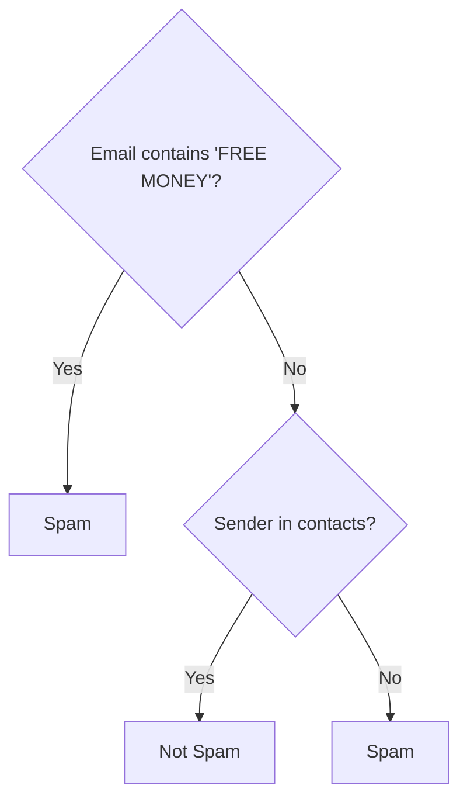

[Previous](./[7]-Introduction-To-Machine-Learning.md) | [Table of Contents](./[0]-Introduction-to-ArtificialIntelligence.md) | [Next](./[9]-Unsupervised-Learning.md)

*Machine Learning*

# Lesson 8 - Supervised Learning

## 8.1 What Is Supervised Learning

**Supervised learning** is the most common category of machine learning, in which a model learns from a dataset of examples that each include both input features and the correct output, or "label." The model's job during training is to learn a general mapping from inputs to outputs, so that when it later receives a new, unlabeled input, it can predict the correct output. Supervised learning gets its name from the idea that the correct labels act like a "supervisor," correcting the model's predictions during training.

> 💡 **Analogy:** It's like learning with flashcards — one side has the question (input), the other has the correct answer (label). You quiz yourself repeatedly, and a "supervisor" (the answer key) corrects you until you get good at it.

---

## 8.2 Regression

**Regression** is supervised learning where the label being predicted is a continuous numeric value — predicting a house's price, a person's age from a photo, or tomorrow's temperature are all regression problems. **Linear regression**, one of the simplest and most interpretable regression techniques, tries to fit a straight line (or plane, in higher dimensions) through the data that minimizes the overall prediction error. More complex regression techniques can fit curved or highly non-linear relationships when a straight line isn't a good fit for the data.

```
Price
  |         *
  |      *    *
  |   *    /--- best-fit line
  | *   /
  |__/________________ Square Footage
```

---

## 8.3 Classification

**Classification** is supervised learning where the label being predicted is a category rather than a number — deciding whether an email is spam or not, identifying which animal appears in a photo, or diagnosing whether a scan shows a tumor are all classification problems. **Binary classification** involves exactly two possible categories (spam / not spam), while **multi-class classification** involves three or more (cat / dog / bird). The output of a classifier is often not just a single category but a probability for each possible category, giving a sense of the model's confidence.

**🔍 Quick Example — Classifier Output**

| Input | Cat | Dog | Bird |
|---|---|---|---|
| photo.jpg | 87% | 10% | 3% |

The model doesn't just say "cat" — it reports *how confident* it is across every category.

---

## 8.4 Common Supervised Algorithms

Several algorithms are commonly used for supervised learning, each with different trade-offs:

- **Linear/logistic regression** — simple, fast, and interpretable, well suited to problems with roughly linear relationships.
- **Decision trees** — split data into branches based on feature values, producing rules that are easy for humans to follow.
- **Random forests** — combine many decision trees to improve accuracy and reduce overfitting compared to a single tree.
- **Support vector machines** — find the boundary that best separates categories, effective on smaller, well-structured datasets.
- **Neural networks** — flexible, powerful models capable of capturing highly complex patterns, explored in depth starting in Lesson 11.

Choosing among these depends on the size and nature of the data, how interpretable the model needs to be, and how much computational power is available.


*A simplified decision tree for spam detection.*

[Previous](./[7]-Introduction-To-Machine-Learning.md) | [Table of Contents](./[0]-Introduction-to-ArtificialIntelligence.md) | [Next](./[9]-Unsupervised-Learning.md)
