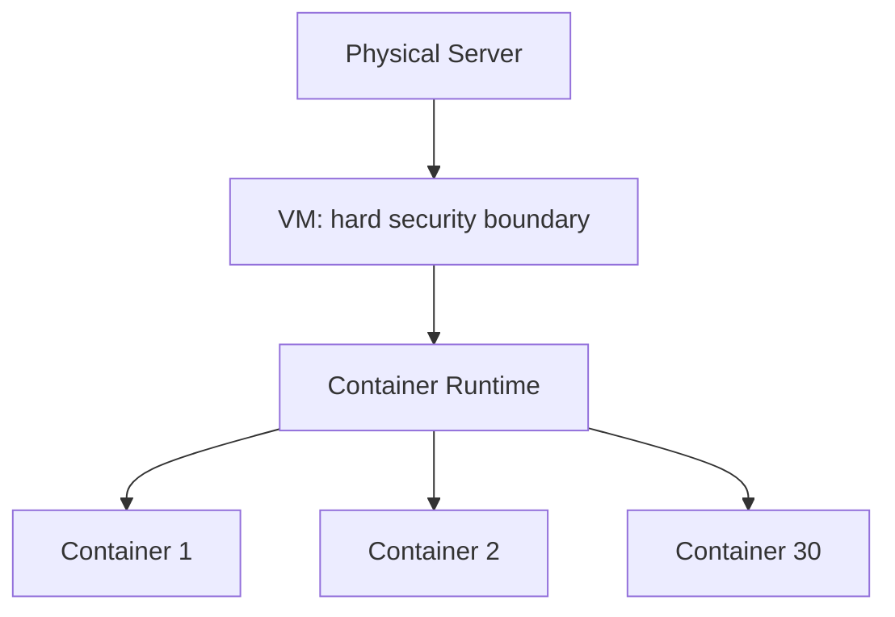

[Previous](./[1]-What-Are-Containers.md) | [Table of Contents](./[0]-Introduction-to-Containers.md) | [Next](./[3]-Container-Images-And-Layers.md)

*Basics*

# Lesson 2 - Containers Vs Virtual Machines

## 2.1 How VMs Work

A virtual machine (VM) emulates an entire computer, including its own guest operating system, running on top of a hypervisor. Each VM has a full OS kernel, its own virtual hardware, and behaves like an independent physical machine, even though several VMs might be running on the same physical server.

This full isolation is powerful, but it comes at a cost: every VM needs enough resources to boot and run a complete operating system, even if the application inside it is small.

> 💡 **Analogy:** A VM is like building a separate house for every tenant, complete with its own foundation, plumbing, and electrical system — total independence, but expensive and slow to construct.

```
┌─────────────────────────────────────────────────┐
│                   Host Machine                   │
│  ┌───────────┐   ┌───────────┐   ┌───────────┐   │
│  │    VM A    │   │    VM B    │   │    VM C    │  │
│  │  Guest OS  │   │  Guest OS  │   │  Guest OS  │  │
│  │  + App     │   │  + App     │   │  + App     │  │
│  └───────────┘   └───────────┘   └───────────┘   │
│  ──────────────────────────────────────────────  │
│                    Hypervisor                     │
│  ──────────────────────────────────────────────  │
│                    Host OS / Kernel                │
└─────────────────────────────────────────────────┘
```

## 2.2 How Containers Work

Containers take a different approach. Instead of emulating hardware and running a separate OS, containers run as isolated processes on the host machine's existing operating system, sharing its kernel. The container packages the application and its dependencies, but not a whole operating system.

This is why containers are often described as "lighter weight" than VMs — they skip the overhead of booting and maintaining a full guest OS for every isolated workload.

> 💡 **Analogy:** Containers are more like apartments in one shared building. Each tenant gets their own locked unit (isolation), but they all share the same foundation, plumbing, and electrical wiring (the host kernel) — much cheaper and faster to set up than a house for everyone.

```
┌─────────────────────────────────────────────────┐
│                   Host Machine                   │
│  ┌───────────┐   ┌───────────┐   ┌───────────┐   │
│  │ Container │   │ Container │   │ Container │   │
│  │  A + App  │   │  B + App  │   │  C + App  │   │
│  └───────────┘   └───────────┘   └───────────┘   │
│  ──────────────────────────────────────────────  │
│              Container Runtime                    │
│  ──────────────────────────────────────────────  │
│                Host OS / Kernel                    │
└─────────────────────────────────────────────────┘
```

## 2.3 Comparing Resource Usage

Because containers share the host kernel, they typically start in a fraction of a second and use far less memory and disk space than a comparable VM. It's common to run dozens of containers on a machine that could only comfortably run a handful of VMs.

VMs, in exchange for their heavier footprint, provide stronger isolation, since each one has its own kernel and is less exposed to issues in sibling workloads.

| | Virtual Machine | Container |
|---|---|---|
| **Startup time** | Seconds to minutes | Milliseconds to seconds |
| **Size** | Gigabytes (full OS) | Megabytes (app + deps only) |
| **Isolation level** | Strong (own kernel) | Process-level (shared kernel) |
| **Density per host** | Tens of VMs | Hundreds of containers |
| **OS flexibility** | Any guest OS | Must be compatible with host kernel |
| **Typical use** | Strong isolation, mixed OSes | Fast, consistent app deployment |

**🔍 Quick Example:** A server that can comfortably run 10 VMs (each needing its own gigabytes of OS overhead) might run 300+ containers of similar-sized applications, because containers skip that per-instance OS tax entirely.

## 2.4 When to Use Which

Neither approach replaces the other entirely:

- **Containers** are well suited to packaging and running applications where speed, density, and consistency across environments matter most.
- **VMs** are well suited to situations that need strong isolation between workloads, or that require an entirely different operating system than the host.

In practice, many production systems use both together — for example, running containers inside VMs to combine the density benefits of containers with the isolation guarantees of VMs.

**Example:** a cloud provider might give you a VM as your "server," and inside that single VM you run a container runtime managing 30 containers — combining the hard security boundary of the VM with the speed and density of containers.



---

[Previous](./[1]-What-Are-Containers.md) | [Table of Contents](./[0]-Introduction-to-Containers.md) | [Next](./[3]-Container-Images-And-Layers.md)
