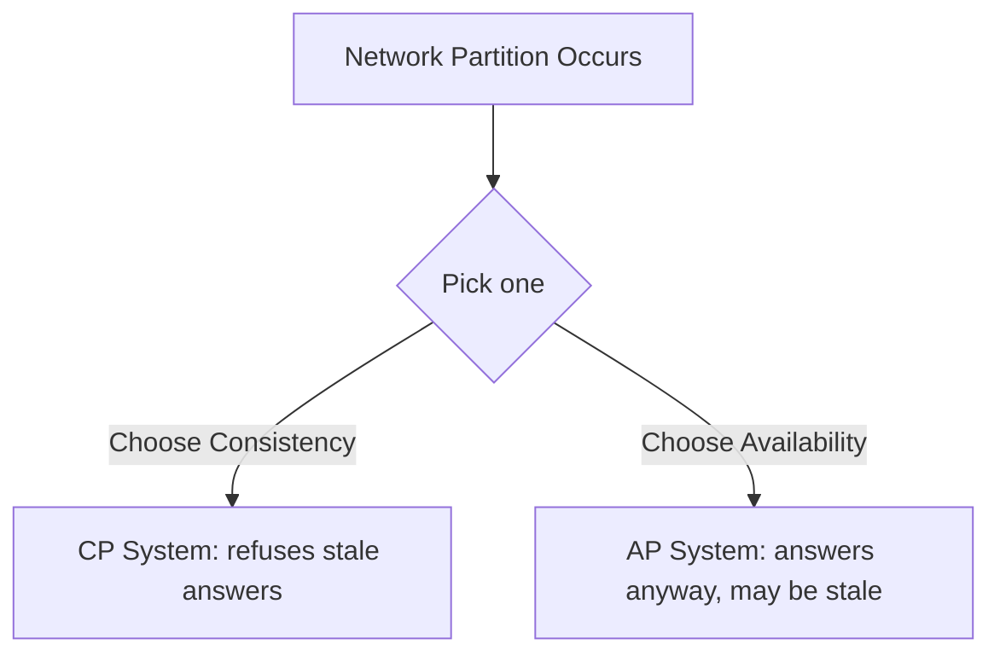

[Previous](./[15]-NoSQL-Database-Types.md) | [Table of Contents](./[0]-Introduction-to-Databases.md) | [Next](./[17]-Database-Administration-Basics.md)

*Beyond Relational*

# Lesson 16 - CAP Theorem And Consistency Models

## 16.1 What Is the CAP Theorem

The **CAP theorem** states that a distributed database (one whose data is spread across multiple machines) can only guarantee two out of the following three properties at the same time:

- **Consistency (C)** — every read receives the most recent write, or an error.
- **Availability (A)** — every request receives a (non-error) response, even if it isn't the most recent data.
- **Partition Tolerance (P)** — the system keeps working even if network communication between machines breaks down (a "partition").

Because networks can and do fail, partition tolerance isn't really optional for a distributed system — so in practice, the CAP theorem is mostly a choice between **Consistency** and **Availability** when a partition happens.

> 💡 **Analogy:** Imagine two branches of a bank that lose their phone line to each other. Consistency means each branch refuses to process withdrawals until it can confirm the account balance with the other branch. Availability means both branches keep serving customers using whatever balance they last knew — risking a brief disagreement.

---

## 16.2 Consistency vs Availability vs Partition Tolerance

Imagine a database replicated across two data centers, and the network link between them goes down (a partition):

- A **CP** system chooses Consistency: it will refuse to answer requests (or return an error) on the side that can't confirm it has the latest data, rather than risk returning stale information.
- An **AP** system chooses Availability: it keeps answering requests on both sides using whatever data it currently has, even though the two sides might briefly disagree.

Neither choice is "correct" in general — it depends entirely on what the application needs. A banking system handling withdrawals typically favors consistency; a social media "like" counter typically favors availability.

---

## 16.3 Strong vs Eventual Consistency

These trade-offs show up as different **consistency models**:

- **Strong consistency** — once a write is confirmed, every subsequent read (from any node) is guaranteed to see it. This is what traditional relational databases provide by default, backed by the Consistency and Isolation guarantees in ACID (see [12.3](./[12]-Transactions-And-ACID.md)).
- **Eventual consistency** — after a write, different nodes may temporarily return different (stale) results, but they're guaranteed to "converge" to the same value once updates finish propagating. Many NoSQL databases (see [Lesson 15](./[15]-NoSQL-Database-Types.md)) default to this model in exchange for higher availability and speed.

For example, a product's stock count updated in one data center might briefly show the old value in another data center, until the update finishes replicating a moment later.

**🔍 Quick Example:** Post something on social media and refresh instantly on a friend's phone across the world — occasionally it's not there yet. That's eventual consistency in action: the write is real, it just hasn't finished propagating everywhere.

---

## 16.4 Choosing a Consistency Model

There's no universally "best" choice — the right model depends on how much staleness the application can tolerate:

- Choose **strong consistency** for data where correctness is critical and stale reads could cause real harm: financial balances, inventory counts that prevent overselling, authentication state.
- Choose **eventual consistency** for data where a brief delay is harmless and high availability/speed matters more: view counts, "likes," activity feeds, product recommendations.

Many modern systems even mix both: using a strongly consistent database for core transactional data, and an eventually consistent store for high-volume, less critical data like analytics or caching.

[Previous](./[15]-NoSQL-Database-Types.md) | [Table of Contents](./[0]-Introduction-to-Databases.md) | [Next](./[17]-Database-Administration-Basics.md)
