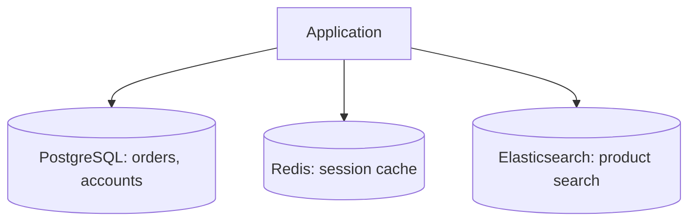

[Previous](./[18]-Scaling-Databases.md) | [Table of Contents](./[0]-Introduction-to-Databases.md)

*Operations And Next Steps*

# Lesson 19 - Choosing A Database Tool

## 19.1 Matching Tools to Tasks

There is no single "best" database — the right choice depends on the shape of your data, how it will be accessed, and how the application needs to scale. Rather than picking a tool because it's popular, it helps to start from the requirements:

- How structured is the data — does every record share the same fields, or does the shape vary?
- How is the data mostly accessed — simple lookups, complex multi-table queries, or traversing relationships?
- Does the data need strong consistency (see [16.3](./[16]-CAP-Theorem-And-Consistency-Models.md)), or can it tolerate eventual consistency in exchange for availability and speed?
- How much data, and how much traffic, does the system need to handle both now and as it grows (see [Lesson 18](./[18]-Scaling-Databases.md))?

---

## 19.2 SQL Databases for Structured Data

Relational (SQL) databases (see [2.1](./[2]-Types-Of-Databases.md)) are a strong default when:

- Data has a clear, consistent structure that fits well into tables, rows, and columns (see [Lesson 4](./[4]-Tables-Rows-And-Columns.md)).
- Relationships between entities matter and need to stay accurate — enforced through foreign keys and constraints (see [Lesson 6](./[6]-Keys-And-Relationships.md)).
- Strong consistency and transactional guarantees are important, such as financial records (see [Lesson 12](./[12]-Transactions-And-ACID.md)).
- You need to run flexible, complex queries across multiple related tables (see [Lesson 11](./[11]-Joins-And-Subqueries.md)).

Typical use cases: e-commerce order systems, banking and accounting software, inventory management, and most traditional business applications.

---

## 19.3 NoSQL Databases for Flexible Data

NoSQL databases (see [Lesson 15](./[15]-NoSQL-Database-Types.md)) tend to be a better fit when:

- The data's shape varies a lot between records, or changes frequently, making a fixed schema restrictive.
- The application needs to scale horizontally to huge volumes of data or traffic (see [18.3](./[18]-Scaling-Databases.md)).
- Simple, high-speed lookups matter more than complex cross-table queries.
- Eventual consistency is an acceptable trade-off for higher availability and performance (see [16.4](./[16]-CAP-Theorem-And-Consistency-Models.md)).

Typical use cases: content management systems and product catalogs (document databases), caching and session storage (key-value stores), large-scale time-series or sensor data (column-family databases), and social networks or recommendation engines (graph databases).

In practice, many real-world systems use more than one type of database together — a technique sometimes called **polyglot persistence** — using each tool where it fits best rather than forcing every kind of data into a single database.

> 💡 **Analogy:** Polyglot persistence is like using different tools in a toolbox — a hammer for nails, a screwdriver for screws. No one demands a single tool handle every job; the same logic applies to picking a relational database for orders and a key-value store for session caching, side by side in the same system.

---

## 19.4 Where to Go Next

This Topic covered the fundamentals that apply across virtually every database, regardless of the specific product. From here, the best way to deepen that understanding is to put it into practice with a real, hands-on tool:

- **[PostgreSQL](./PostgreSQL/[0]-Introduction-to-PostgreSQL.md)** — a widely-used open-source relational database, and a natural next step for practicing everything covered in this Topic's SQL and relational design lessons.
- **[MongoDB](./MongoDB/[0]-Introduction-to-MongoDB.md)** — a widely-used document-oriented NoSQL database, a natural next step for practicing the concepts from [Lesson 15](./[15]-NoSQL-Database-Types.md).

Working through the concepts here first, before diving into any one tool's syntax, makes it much easier to transfer what you've learned to *any* database technology you encounter in the future.

[Previous](./[18]-Scaling-Databases.md) | [Table of Contents](./[0]-Introduction-to-Databases.md)
