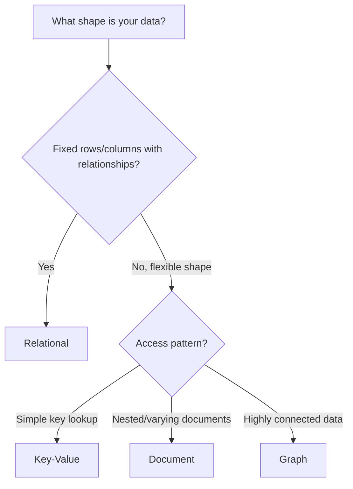

[Previous](./[1]-What-Are-Databases.md) | [Table of Contents](./[0]-Introduction-to-Databases.md) | [Next](./[3]-Database-Management-Systems.md)

*Basics*

# Lesson 2 - Types Of Databases

## 2.1 Relational Databases

**Relational databases** store data in tables made of rows and columns, similar to a spreadsheet, but with strict rules connecting tables to one another. Each table represents one kind of entity (like `customers` or `orders`), and relationships between tables are defined using keys (covered in [Lesson 6](./[6]-Keys-And-Relationships.md)).

Relational databases are queried using **SQL** (Structured Query Language) and are built around a fixed schema — the shape of the data is defined up front. Examples include PostgreSQL, MySQL, and SQLite.

> 💡 **Analogy:** A relational database is like a well-organized filing cabinet with labeled folders (tables), each containing forms with the exact same fields (columns) — and cross-reference numbers linking related folders together.

---

## 2.2 NoSQL Databases

**NoSQL** ("Not Only SQL") databases cover a broad family of databases that don't use the traditional table-based relational model. They were built to handle data that doesn't fit neatly into rows and columns, or that needs to scale across many machines more easily than traditional relational systems. Common NoSQL categories include:

- **Document databases** — store data as flexible, JSON-like documents (e.g., MongoDB).
- **Key-value stores** — store simple key-to-value pairs (e.g., Redis).
- **Column-family databases** — store data in columns grouped by family for fast analytical reads (e.g., Cassandra).
- **Graph databases** — store data as nodes and edges, optimized for relationships (e.g., Neo4j).

These are explored in more depth in [Lesson 15](./[15]-NoSQL-Database-Types.md).

---

## 2.3 Other Database Types

Beyond the relational/NoSQL split, a few specialized database types are worth knowing:

- **Time-series databases** — optimized for data points indexed by time, like sensor readings or metrics (e.g., InfluxDB).
- **Search engines** — optimized for full-text search across large volumes of text (e.g., Elasticsearch).
- **In-memory databases** — keep data primarily in RAM for extremely low-latency access (e.g., Redis, Memcached).
- **NewSQL databases** — aim to combine the horizontal scalability of NoSQL with the strong consistency guarantees of relational systems (e.g., CockroachDB).

---

## 2.4 Comparing Use Cases

No single database type is "best" — the right choice depends on the shape of the data and how it will be used:

| Need | Good Fit |
|---|---|
| Structured data with strict relationships (e.g., banking records) | Relational |
| Rapidly changing, flexible data (e.g., user profiles with varying fields) | Document (NoSQL) |
| Extremely fast key-based lookups (e.g., session caching) | Key-value (NoSQL) |
| Deeply connected data (e.g., social networks) | Graph (NoSQL) |
| Metrics or sensor data over time | Time-series |

This table is a starting point, not a rulebook — many real systems combine multiple database types, using each where it fits best.

[Previous](./[1]-What-Are-Databases.md) | [Table of Contents](./[0]-Introduction-to-Databases.md) | [Next](./[3]-Database-Management-Systems.md)
