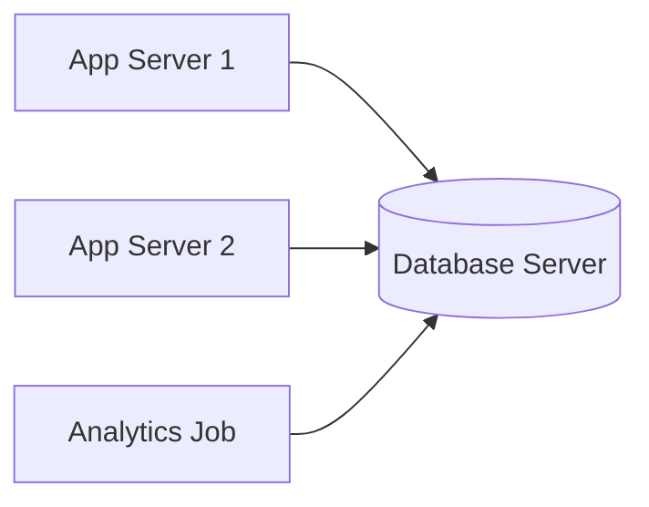

[Previous](./[2]-Types-Of-Databases.md) | [Table of Contents](./[0]-Introduction-to-Databases.md) | [Next](./[4]-Tables-Rows-And-Columns.md)

*Basics*

# Lesson 3 - Database Management Systems

## 3.1 What Is a DBMS

A **Database Management System (DBMS)** is the software layer that sits between the raw stored data and everyone who wants to use it. Instead of applications reading and writing raw files directly, they talk to the DBMS, which handles storage, retrieval, and enforcement of rules on their behalf.

When people say "I'm using PostgreSQL" or "I'm using MongoDB," they're referring to a specific DBMS.

> 💡 **Analogy:** Think of the DBMS as a librarian standing between you and a massive archive. You never rifle through the shelves yourself — you ask the librarian, who knows exactly where everything is, enforces the rules (no removing reference books), and hands you exactly what you asked for.

---

## 3.2 Core Responsibilities of a DBMS

A DBMS typically takes on several jobs so that individual applications don't have to reinvent them:

- **Data storage and retrieval** — deciding how data is physically stored on disk and fetched efficiently.
- **Schema and constraint enforcement** — making sure data follows the rules defined for it (types, uniqueness, required fields).
- **Concurrency control** — letting multiple users read and write safely at the same time (see [Lesson 14](./[14]-Concurrency-And-Locking.md)).
- **Transaction management** — grouping operations so they either fully succeed or fully fail (see [Lesson 12](./[12]-Transactions-And-ACID.md)).
- **Security** — authenticating users and authorizing what they're allowed to do.
- **Backup and recovery** — protecting against data loss from crashes or hardware failure.

---

## 3.3 Client-Server Architecture

Most DBMSs run as a **server** — a long-running process that listens for connections — while applications act as **clients** that connect to it over a network (even if that network is just `localhost`). This separation means:

- Multiple applications, on multiple machines, can share one database.
- The database can live on dedicated, well-resourced hardware separate from the application.
- Access can be centrally controlled and audited at the server.

Some databases, like SQLite, break this pattern by running as an embedded library directly inside the application rather than a separate server — a useful trade-off for smaller or single-user applications.

**🔍 Quick Example:** SQLite skips the client-server split entirely — it's a library linked directly into your app, storing everything in a single file. Great for a mobile app's local storage; not built for many separate applications sharing data over a network.

---

## 3.4 Popular DBMS Examples

A few widely-used DBMSs, spanning both relational and NoSQL:

- **PostgreSQL** — a powerful, open-source relational database known for standards compliance and extensibility.
- **MySQL** — a widely-deployed open-source relational database, popular in web applications.
- **SQLite** — a lightweight, embedded relational database with no separate server process.
- **MongoDB** — a popular document-oriented NoSQL database.
- **Redis** — an in-memory key-value store often used for caching.

Each of these is explored hands-on in its own folder once you've completed this Topic.

[Previous](./[2]-Types-Of-Databases.md) | [Table of Contents](./[0]-Introduction-to-Databases.md) | [Next](./[4]-Tables-Rows-And-Columns.md)
