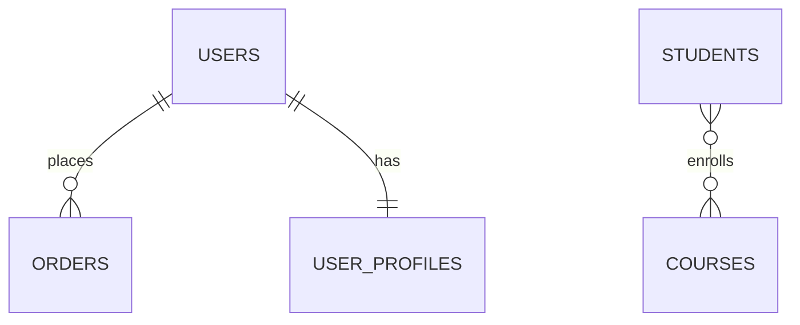

[Previous](./[5]-Schemas-And-Data-Types.md) | [Table of Contents](./[0]-Introduction-to-Databases.md) | [Next](./[7]-Normalization.md)

*Relational Design*

# Lesson 6 - Keys And Relationships

## 6.1 Primary Keys

A **primary key** is a column (or set of columns) whose value uniquely identifies each row in a table. No two rows may share a primary key, and it can never be `NULL`. Most tables use a simple auto-incrementing integer (`id`) as their primary key, though other unique values (like a UUID) work too.

Primary keys are what allow other tables to reliably reference a specific row, which is the basis for how relationships between tables work.

> 💡 **Analogy:** A primary key is like a social security number or passport number — no two people share one, and it uniquely identifies you no matter how many people share your name.

---

## 6.2 Foreign Keys

A **foreign key** is a column in one table that stores the primary key value of a row in another table, creating a link between the two. For example, an `orders` table might have a `user_id` column that is a foreign key referencing the `id` column in the `users` table — this records which user placed each order.

The DBMS can enforce **referential integrity**, rejecting any attempt to insert an order with a `user_id` that doesn't exist in the `users` table, or (depending on configuration) preventing deletion of a user who still has orders.

```
users                    orders
┌────┬────────┐          ┌────┬─────────┬───────┐
│ id │ name   │          │ id │ user_id │ total │
├────┼────────┤          ├────┼─────────┼───────┤
│ 1  │ Ana    │ ◀───────┐│ 1  │   1     │ 49.99 │
│ 2  │ Ben    │         └│ 2  │   1     │ 12.50 │
└────┴────────┘          │ 3  │   2     │ 30.00 │
                          └────┴─────────┴───────┘
                          (user_id is a foreign key → users.id)
```

---

## 6.3 One-to-Many, Many-to-Many, and One-to-One

Relationships between tables generally fall into three shapes:

- **One-to-many** — one row in table A relates to many rows in table B, but each row in B relates to only one row in A. Example: one `user` has many `orders`.
- **Many-to-many** — rows in table A can relate to many rows in table B, and vice versa. Example: `students` and `courses` — a student takes many courses, and a course has many students. This is implemented using a **junction table** (e.g., `enrollments`) that stores pairs of foreign keys.
- **One-to-one** — one row in table A relates to exactly one row in table B. Example: a `user` and their `user_profile`, when profile data is kept in a separate table for organizational reasons.

> 💡 **Analogy:** One-to-many is like one author writing many books. Many-to-many is like students and courses — no student takes just one course, and no course has just one student, so you need a class roster (junction table) to track every pairing.

---

## 6.4 Entity-Relationship Diagrams

An **Entity-Relationship Diagram (ERD)** is a visual way to plan and communicate a database schema before building it. Each table is drawn as a box listing its columns, and lines between boxes show relationships, often labeled with the cardinality (one-to-many, many-to-many, etc.).

Sketching an ERD before writing any SQL is a common and useful step in database design — it surfaces missing relationships and awkward table structures early, when they're cheap to fix.



[Previous](./[5]-Schemas-And-Data-Types.md) | [Table of Contents](./[0]-Introduction-to-Databases.md) | [Next](./[7]-Normalization.md)
